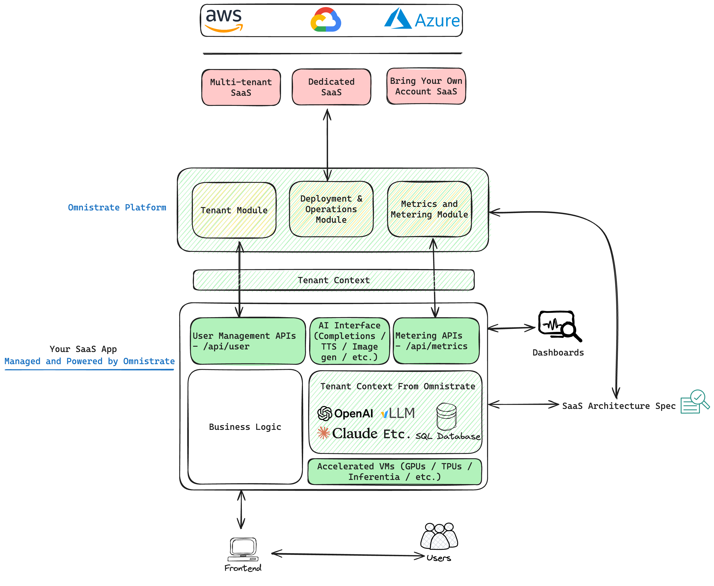

# Private AI Chatbot

A multi-tenant ChatBot for managing AI-powered chat interactions with authentication, tenant management, usage tracking and metrics tracking capabilities powered by [Omnistrate](https://omnistrate.com)
and Llama 3.1

## Features

- User Authentication
- Chat Thread Management
- Metrics Monitoring
- vLLM using the Llama 3.1 model on the newest generation of accelerated hardware from AWS (g6e)

## Getting Started

### Prerequisites
- Go 1.23
- Database (configuration details required)
- Omnistrate CLI (https://ctl.omnistrate.cloud/install/)
- An Omnistrate account (https://omnistrate.cloud/signup)

### Launching the service

1. Clone the repository:
    ```bash
    git clone https://github.com/omnistrate-community/ai-chatbot.git
    ```

2. Setup your Omnistrate CLI - See [Omnistrate CLI](https://ctl.omnistrate.cloud/install)

3. Add your AWS account details to the `omnistrate-spec.yaml` file:

4. Launch your SaaS with Omnistrate:
    ```bash
    omctl build-from-repo -f omnistrate-spec.yaml
    ```


## Architecture



The service contains pre-defined modules for metrics, user management and LLM inferencing.

### Omnistrate modules:
- The `pkg/model` package contains the database models
- The `pkg/utils` package contains utility functions for the service.
- The `pkg/metrics` package contains the metrics server for the service.
- The `pkg/auth` package contains the user authentication logic for the service.

### Custom modules:
- The `pkg/core` package contains the business logic for the chatbot. 

## Deployment

Omnistrate automates the deployment of your SaaS in addition to providing the necessary modules to build your SaaS.
Once the service is launched, you can deploy a version of your SaaS service in your pre-created Dev environment using the SaaS portal link from the previous step.
